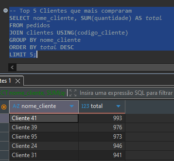

# Projeto SQL – Análise de Vendas por Filial e Região

## 📌 Descrição
Projeto de banco de dados relacional desenvolvido em PostgreSQL a partir de um dataset de vendas em CSV.

O objetivo foi modelar o banco, garantir integridade referencial e responder perguntas de negócio usando SQL.

## 🛠 Tecnologias
- PostgreSQL
- DBeaver
- SQL (DDL, DML, Views, Aggregations)

## 📂 Estrutura do Projeto
- Criação de tabelas normalizadas
- Importação de dados via COPY
- Queries analíticas
- View pivot de vendas por região e filial

## 📊 Análises Realizadas
- Top 5 clientes por volume de compras
- Top 3 produtos mais vendidos
- Produto mais vendido por marca (Jul–Dez/2023)
- View pivot de vendas por região e filial
- Acumulado de vendas por filial e UF

## 🖼 Exemplo de Resultado

## 📄 Observações
Projeto focado em lógica SQL, modelagem relacional e análise de dados.
